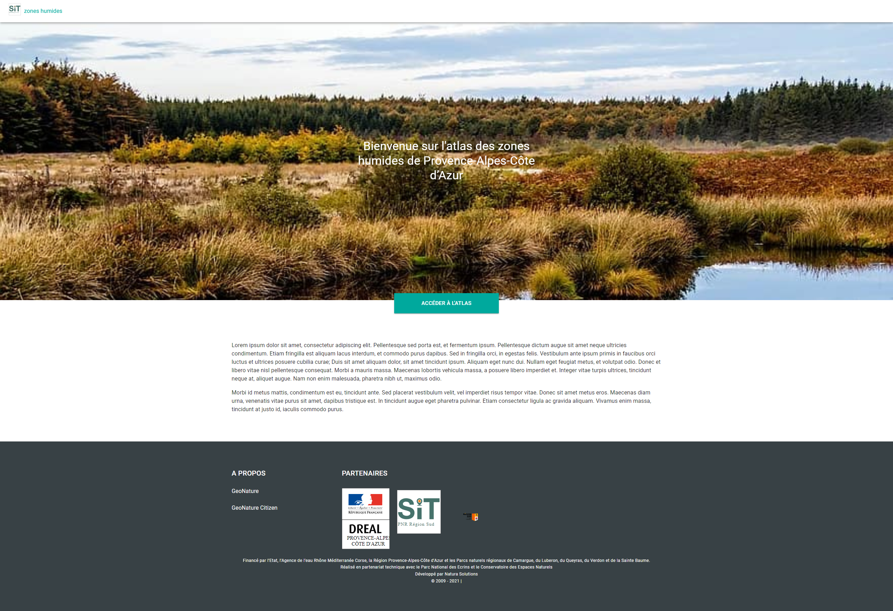

## Structure du projet

La configuration se trouve dans le dossier [`./data/config.yml`](https://github.com/PnX-SI/GeoNature-ZH-atlas/blob/main/data/config.yml){.external-link target=\_blank} et est écrite au format [YAML][yaml]{ .external-link target=\_blank}.

```bash
.
├── data
│   └── config.yml
├── ...
```

## Les fichiers statiques

Les fichiers statiques, comme les images, se trouvent dans un dossier nommé `public` dans le répertoire racine. Les fichiers contenus dans public peuvent ensuite être référencés par votre configuration à partir de l'URL de base `/`.

```bash
.
├── ...
├── public
│   ├── favicon.ico
│   ├── geonature.geojson
│   └── images
│       ├── hero.png
│       ├── zh.jpg
│       ├── zh2.jpg
│       └── zh3.jpg
│       ├── ...
├── ...
```

Par exemple, si vous ajoutez une image dans `public/image.png`, la configuration suivante accédera à l'image :

```yaml
---
pages:
  home:
    images:
      - src: /image.png
---
```

## Fichier du configuration

La configuration de l'application est divisée en deux sections principales : nous avons d'une part la configuration générale du template (**layout**), et d'autre part la configuration de la page d'accueil (**pages.home**).

### Configuration générale du template


Toutes les pages de l'application partagent des éléments communs, tels que l'en-tête et le pied de page. Les paramètres suivants sont disponibles pour l'adapter à vos besoins :

#### Header

Dans l'en-tête, nous pouvons configurer :

##### Logo

| Propriété | Description                                                                                                                     |
| --------- | ------------------------------------------------------------------------------------------------------------------------------- |
| alt       | Contient une description textuelle de l'image, qui n'est pas obligatoire mais qui est très utile pour l'accessibilité           |
| src       | Est obligatoire et contient le chemin de l'image qu'on souhaite afficher.                                                       |

```yaml
---
layout:
  header:
    logo:
      alt: 'logo'
      src: /images/partenaires/logo_sit.svg
---
```

#### Footer

Dans le pied de page, nous pouvons configurer :

##### Creator

Texte indiquant le propriétaire ou l'administrateur du site

```yaml
---
layout:
  footer:
    creator: SIT zones humides
---
```

##### hero

Image en en-tête du pied de page

```yaml
---
layout:
  footer:
    hero: 'hero.svg'
---
```

##### Legal

```yaml
---
layout:
  footer:
    legal:
      - Financé par l’Etat, l’Agence de l’eau Rhône Méditerranée Corse, la Région Provence-Alpes-Côte d’Azur et les Parcs naturels régionaux de Camargue, du Luberon, du Queyras, du Verdon et de la Sainte Baume.
      - Réalisé en partenariat technique avec le Parc National des Ecrins et le Conservatoire des Espaces Naturels
---
```

##### Links

Il est possible d'ajouter des liens d'intérêt vers d'autres sites.

| Propriété | Description                                                                                                                     |
| --------- | ------------------------------------------------------------------------------------------------------------------------------- |
| title     | Contient une description textuelle de l'image, qui n'est pas obligatoire mais qui est très utile pour l'accessibilité           |
| href      | L'URL vers laquelle pointe l'hyperlien                                                                                          |

```yaml
---
layout:
  links:
    - title: GeoNature
      href: https://geonature.fr
    - title: GeoNature Citizen
      href: https://www.natural-solutions.eu/blog/geonature-citizen
---
```

##### Images

Images des partenaires

| Propriété | Description                                                                                                                     |
| --------- | ------------------------------------------------------------------------------------------------------------------------------- |
| alt       | Contient une description textuelle de l'image, qui n'est pas obligatoire mais qui est très utile pour l'accessibilité           |
| src       | Est obligatoire et contient le chemin de l'image qu'on souhaite afficher.                                                       |

```yaml
---
layout:
  header:
    images:
      - src: '/images/partenaires/dreal_paca.svg'
        alt: 'DREAL PACA'
      - src: '/images/partenaires/logo_sit.svg'
        alt: 'SIT'
      - src: '/images/partenaires/region_sud.svg'
        alt: 'Region Sud'
---
```

### Configuration de la page d'accueil



##### Title

Titre de la page d'accueil

```yaml
---
pages:
  home:
    title: Bienvenue sur l'atlas des zones humides de Provence-Alpes-Côte d’Azur
---
```

##### Text

Description de la page d'accueil

```yaml
---
pages:
  home:
    text:
      - Lorem ipsum dolor sit amet, consectetur adipiscing elit. Pellentesque sed porta est, et fermentum ipsum. Pellentesque dictum augue sit amet neque ultricies condimentum. Etiam fringilla est aliquam lacus interdum, et commodo purus dapibus. Sed in fringilla orci, in egestas felis. Vestibulum ante ipsum primis in faucibus orci luctus et ultrices posuere cubilia curae; Duis sit amet aliquam dolor, sit amet tincidunt ipsum. Aliquam eget nunc dui. Nullam eget feugiat metus, et volutpat odio. Donec et libero vitae nisl pellentesque consequat. Morbi a mauris massa. Maecenas lobortis vehicula massa, a posuere libero imperdiet et. Integer vitae turpis ultrices, tincidunt neque at, aliquet augue. Nam non enim malesuada, pharetra nibh ut, maximus odio.
      - Morbi id metus mattis, condimentum est eu, tincidunt ante. Sed placerat vestibulum velit, vel imperdiet risus tempor vitae. Donec sit amet metus eros. Maecenas diam urna, venenatis vitae purus sit amet, dapibus tristique est. In tincidunt augue eget pharetra pulvinar. Etiam consectetur ligula ac gravida aliquam. Vivamus enim massa, tincidunt at justo id, iaculis commodo purus.
---
```

##### Images

Images de la page d'accueil

| Propriété | Description                                                                                                                     |
| --------- | ------------------------------------------------------------------------------------------------------------------------------- |
| alt       | Contient une description textuelle de l'image, qui n'est pas obligatoire mais qui est très utile pour l'accessibilité           |
| src       | Est obligatoire et contient le chemin de l'image qu'on souhaite afficher.                                                       |

```yaml
---
pages:
  home:
    images:
      - src: /images/zh.jpg
        alt: zone humide 1
      - src: /images/zh2.jpg
        alt: zone humide 2
      - src: /images/zh3.jpg
        alt: zone humide 3
---
```

### Dépendances

##### API URL
URL de l'API du module GeoNature sur les zones humides permettant 
notamment d'obtenir les photos de chaque zone humide

```yaml
---
dependencies:
  apiurl: http://localhost:8000/zones_humides/
---
```

##### PBF

URL de la route API du module GeoNature sur les zones humides renvoyant le 
fichier [PBF][pbf]{ .external-link target=\_blank}. contenant les 
géométries et informations des zones humides.


```yaml
---
dependencies:
  pbf: http://localhost:8000/zones_humides/pbf/complete
---
```

##### PDF

URL de la route API du module GeoNature Zone Humides renvoyant le fichier
PDF de chaque zone humide.

```yaml
---
dependencies:
  pdf: http://localhost:8000/zones_humides/export_pdf
---
```

Il est à noter que l'URL de l'API est répété pour ces dépendences, ce 
choix a été fait afin d'être plus flexible dans la localisation des 
données.

### Configuration de la carte

Il est possible de configurer les couches cartographiques disponibles aux
utilisateurs via la configuration suivante :

```yaml
---
map:
  layers:
    - checked: true
      url: https://wxs.ign.fr/decouverte/geoportail/wmts?LAYER=ORTHOIMAGERY.ORTHOPHOTOS&EXCEPTIONS=text/xml&FORMAT=image/jpeg&SERVICE=WMTS&VERSION=1.0.0&REQUEST=GetTile&STYLE=normal&TILEMATRIXSET=PM&TILEMATRIX={z}&TILEROW={y}&TILECOL={x}
      name: ORTHO
      attribution: IGN
    - checked: false
      url: https://a.tile.opentopomap.org/{z}/{x}/{y}.png
      name: OpenTopoMap
      attribution: > 
        Map data: © <a href='https://www.openstreetmap.org/copyright' target='_blank'>OpenStreetMap contributors</a>, SRTM | Map style: © <a href='https://opentopomap.org' target='_blank'>OpenTopoMap</a> (<a href='https://creativecommons.org/licenses/by-sa/3.0/' target='_blank'>CC-BY-SA</a>)
      options: {maxNativeZoom: 17}
      subdomains: []
---
```

- `checked` permet de définir la couche par défaut
- `url` l'url de la couche
- `name` le nom affiché à l'utilisateur
- `attribution` permet de déterminer les créateurs de la données, n'est pas
  affiché à l'utilisateur
- `options` permet de définir des options de couche. Notamment le `maxNativeZoom`
  qui empêche l'affichage de tuiles "grises" car non disponibles
- `subdomains` sous domaine du service de tuile

## Exemple complet de configuration

```yaml
dependencies:
  apiurl: http://localhost:8000/zones_humides/
  pdf: http://localhost:8000/zones_humides/export_pdf
  pbf: http://localhost:8000/zones_humides/pbf/complete

map:
  layers:
    - checked: true
      url: https://wxs.ign.fr/decouverte/geoportail/wmts?LAYER=ORTHOIMAGERY.ORTHOPHOTOS&EXCEPTIONS=text/xml&FORMAT=image/jpeg&SERVICE=WMTS&VERSION=1.0.0&REQUEST=GetTile&STYLE=normal&TILEMATRIXSET=PM&TILEMATRIX={z}&TILEROW={y}&TILECOL={x}
      name: ORTHO
      attribution: IGN
    - checked: false
      url: https://a.tile.opentopomap.org/{z}/{x}/{y}.png
      name: OpenTopoMap
      attribution: >
        Map data: © <a href='https://www.openstreetmap.org/copyright' target='_blank'>OpenStreetMap contributors</a>, SRTM | Map style: © <a href='https://opentopomap.org' target='_blank'>OpenTopoMap</a> (<a href='https://creativecommons.org/licenses/by-sa/3.0/' target='_blank'>CC-BY-SA</a>)
      options: {maxNativeZoom: 17}
      subdomains: []

pages:
  home:
    title: Bienvenue sur l'atlas des zones humides de Provence-Alpes-Côte d’Azur
    text:
      - Lorem ipsum dolor sit amet, consectetur adipiscing elit. Pellentesque sed porta est, et fermentum ipsum. Pellentesque dictum augue sit amet neque ultricies condimentum. Etiam fringilla est aliquam lacus interdum, et commodo purus dapibus. Sed in fringilla orci, in egestas felis. Vestibulum ante ipsum primis in faucibus orci luctus et ultrices posuere cubilia curae; Duis sit amet aliquam dolor, sit amet tincidunt ipsum. Aliquam eget nunc dui. Nullam eget feugiat metus, et volutpat odio. Donec et libero vitae nisl pellentesque consequat. Morbi a mauris massa. Maecenas lobortis vehicula massa, a posuere libero imperdiet et. Integer vitae turpis ultrices, tincidunt neque at, aliquet augue. Nam non enim malesuada, pharetra nibh ut, maximus odio.
      - Morbi id metus mattis, condimentum est eu, tincidunt ante. Sed placerat vestibulum velit, vel imperdiet risus tempor vitae. Donec sit amet metus eros. Maecenas diam urna, venenatis vitae purus sit amet, dapibus tristique est. In tincidunt augue eget pharetra pulvinar. Etiam consectetur ligula ac gravida aliquam. Vivamus enim massa, tincidunt at justo id, iaculis commodo purus.
    images:
      - src: /images/zh.jpg
        alt: zone humide 1
      - src: /images/zh2.jpg
        alt: zone humide 2
      - src: /images/zh3.jpg
        alt: zone humide 3

layout:
  header:
    logo:
      alt: 'logo'
      src: /images/partenaires/logo_sit.svg
  footer:
    creator: SIT zones humides
    legal:
      - Financé par l’Etat, l’Agence de l’eau Rhône Méditerranée Corse, la Région Provence-Alpes-Côte d’Azur et les Parcs naturels régionaux de Camargue, du Luberon, du Queyras, du Verdon et de la Sainte Baume.
      - Réalisé en partenariat technique avec le Parc National des Ecrins et le Conservatoire des Espaces Naturels
    hero: 'hero.svg'
    images:
      - src: '/images/partenaires/dreal_paca.svg'
        alt: 'DREAL PACA'
      - src: '/images/partenaires/logo_sit.svg'
        alt: 'SIT'
      - src: '/images/partenaires/region_sud.svg'
        alt: 'Region Sud'
    links:
      - title: GeoNature
        href: https://geonature.fr
      - title: GeoNature Citizen
        href: https://www.natural-solutions.eu/blog/geonature-citizen
```

[yaml]: https://fr.wikipedia.org/wiki/YAML
[pbf]: https://wiki.openstreetmap.org/wiki/PBF_Format
