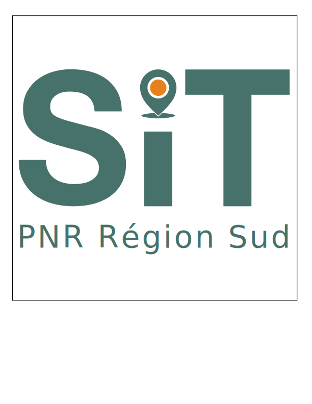
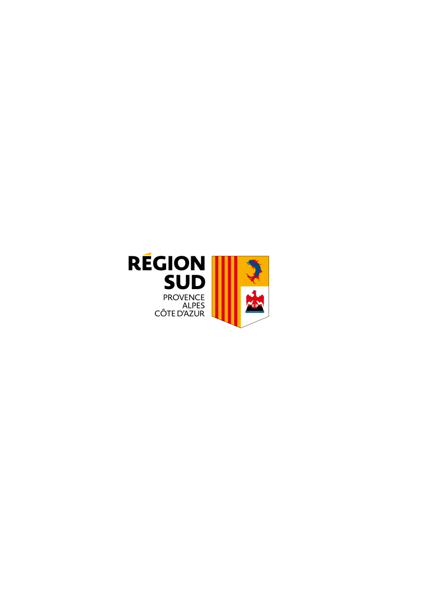

# GeoNature Zone Humide Atlas

Bienvenue sur la documentation du projet **GeoNature Zone Humide Atlas**

---

**Documentation**: [https://pnx-si.github.io/GeoNature-ZH-atlas/][doc]{ .external-link target=\_blank}

**Code source**: [https://github.com/PnX-SI/GeoNature-ZH-atlas/][source_code]{ .external-link target=\_blank}

---

## Introduction

L'atlas Zones Humides a pour vocation de partager aux élus, aux acteurs travaillant sur des thématiques liées aux zones humides, ainsi qu'au grand public des informations sur la gestion des zones humides d'un territoire. Ces données proviennent de l'application métier [GeoNature][geonature]{.external-link target=\_blank} et plus particulièrement son [module Zones Humides][git_gn_module_zh]{.external-link target=\_blank} qui en permet la saisie.

Cette suite d'outils permettant la gestion des zones humides d'un territoire a été financée par la DREAL PACA, l'Agence de l'eau, la région Sud et le CEN PACA, commandée par le Parc naturel régional du Luberon, et développée par Natural Solutions.

[source_code]: https://github.com/PnX-SI/GeoNature-ZH-atlas/
[doc]: https://pnx-si.github.io/GeoNature-ZH-atlas/
[geonature]: https://geonature.fr
[git_gn_module_zh]: https://github.com/PnX-SI/gn_module_ZH

## Partenaires

{width=100}
{width=100}
{width=100}
